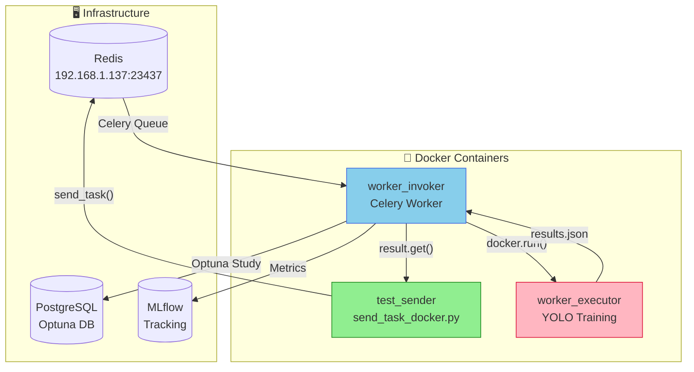
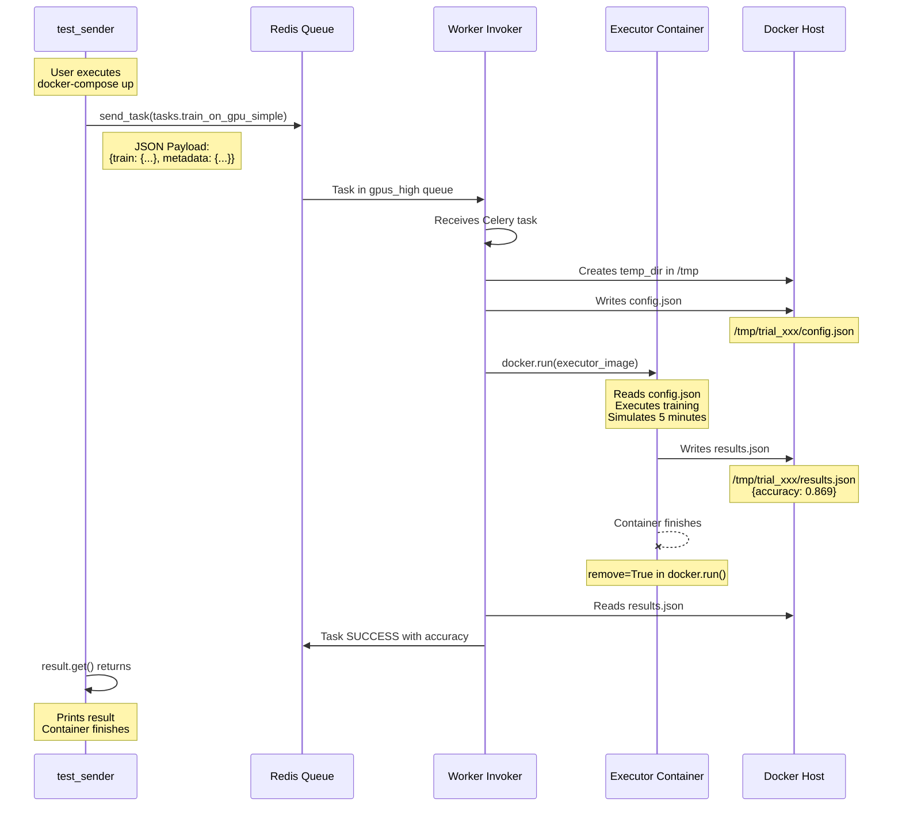
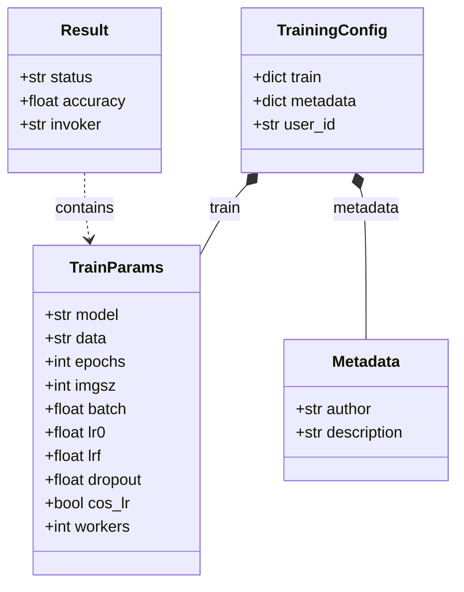

# Manual Test - Invoker

Manual tests of the Invoker-Executor flow via Celery and Docker.

## Structure

```
test_manual/
├── config.yaml              # Redis connection configuration
├── training_config.yaml     # Training hyperparameters
├── celery_config.py        # Celery connection module (for scripts)
├── send_task.py           # Sends task directly (development)
├── send_task_docker.py    # Sends task (for docker)
├── Dockerfile             # Test container image
├── docker-compose.yml     # Docker orchestration
├── requirements.txt       # Python dependencies
└── README.md             # This file
```

## System Architecture



## Complete Data Flow



## Quick Start

```bash
# 1. Make sure Redis and Worker are running
docker ps | grep redis
ps aux | grep celery | grep worker

# 2. Run test
cd test_manual
docker-compose up --build

# 3. The container:
#    - Sends task to Celery
#    - Waits for Executor result
#    - Prints results
#    - Dies

# 4. Repeat
docker-compose up --build
```

## Visual Step-by-Step Flow

```mermaid
flowchart LR
    subgraph SEND["📤 Send"]
        A1[docker-compose up] --> A2[Build image]
        A2 --> A3[Execute send_task_docker.py]
        A3 --> A4[Celery send_task()]
    end

    subgraph PROCESS["⚙️ Processing"]
        A4 --> B1[Redis gpus_high queue]
        B1 --> B2[Worker Invoker receives]
        B2 --> B3[Docker Executor]
        B3 --> B4[Training ~5min]
        B4 --> B5[results.json]
    end

    subgraph RESPONSE["📥 Response"]
        B5 --> C1[Worker reads accuracy]
        C1 --> C2[Celery result.get()]
        C2 --> C3[Print result]
        C3 --> C4[✓ TEST COMPLETED]
    end

    style SEND fill:#90EE90
    style PROCESS fill:#87CEEB
    style RESPONSE fill:#FFD700
```

## Expected Output

```
============================================================
DOCKER TEST: Sending task to Invoker
============================================================
Redis: redis://192.168.1.137:23437/0
Queue: gpus_high
Task: tasks.train_on_gpu_simple

[1] Sending task...
    Task ID: abc123-def456-...
    Status: PENDING

[2] Waiting for result (timeout: 600s)...

============================================================
RESULT RECEIVED
============================================================
Task ID: abc123-def456-...
Status: SUCCESS
Result: {
  "status": "done",
  "accuracy": 0.869,
  "invoker": "test_worker"
}

✓ Accuracy: 0.869
============================================================
TEST COMPLETED SUCCESSFULLY
============================================================
```

## Previous Requirements

1. **Redis** running at `192.168.1.137:23437`
2. **Worker Invoker** listening to the `gpus_high` queue

### Start Worker Invoker (if not running)

```bash
cd ../app
REDIS_URL=redis://192.168.1.137:23437/0 \
PRIVATE_QUEUE=test_worker \
celery -A worker_gpu worker \
-Q gpus_high \
--loglevel=info \
--concurrency=1 \
--hostname=test_worker@%h
```

### View Active Workers

```bash
docker exec environment-redis-1 redis-cli KEYS "*"
ps aux | grep celery | grep worker
```

## Configuration

### config.yaml (for development scripts)

```yaml
redis:
  host: "192.168.1.137"
  port: 23437
  db: 0

celery:
  queue: "gpus_high"
  task_name: "tasks.train_on_gpu_simple"
```

### docker-compose.yml

```yaml
services:
  test_sender:
    build: .
    environment:
      - REDIS_URL=redis://192.168.1.137:23437/0
      - QUEUE_NAME=gpus_high
    network_mode: host
```

### training_config.yaml

```yaml
train:
  model: "yolov8n-cls.pt"
  epochs: 10
  imgsz: 640
  lr0: 0.01
  batch: 0.85
```

## Data Structure



## Troubleshooting

### Error: Connection refused

```bash
# Verify Redis
docker exec environment-redis-1 redis-cli ping
# Should respond: PONG
```

### Empty queue, worker does not receive

```bash
# View queues
docker exec environment-redis-1 redis-cli KEYS "*"

# Clear and retry
docker exec environment-redis-1 redis-cli FLUSHALL
docker-compose up --build
```

### Worker does not start executor

```bash
# View worker logs
cat /tmp/worker_test.log

# View executor containers
docker ps | grep executor
```

## Development (without Docker)

To test directly without docker-compose:

```bash
pip install -r requirements.txt
python send_task.py
```

Or use the local worker:

```bash
cd ../app
celery -A worker_gpu worker -Q gpus_high --loglevel=info
```
