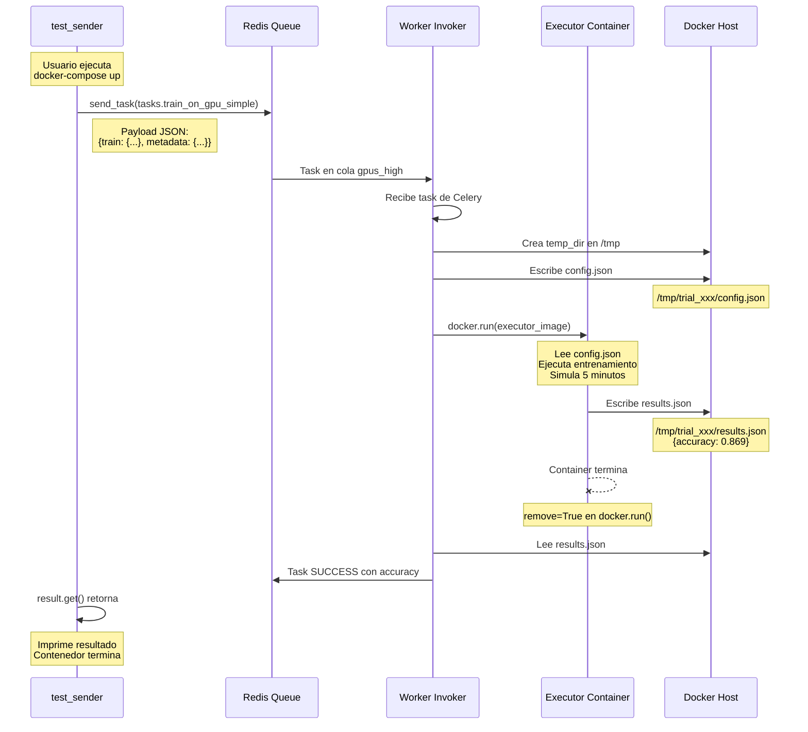

# Test Manual - Invoker

Pruebas manuales del flujo Invoker-Executor via Celery y Docker.

## Estructura

```
test_manual/
├── config.yaml              # Configuración de conexión Redis
├── training_config.yaml     # Hiperparámetros del entrenamiento
├── celery_config.py        # Módulo de conexión Celery (para scripts)
├── send_task.py           # Envía tarea directamente (desarrollo)
├── send_task_docker.py    # Envía tarea (para docker)
├── Dockerfile             # Imagen del contenedor de prueba
├── docker-compose.yml     # Orquestación Docker
├── requirements.txt       # Dependencias Python
└── README.md             # Este archivo
```

## Arquitectura del Sistema


## Flujo de Datos Completo



## Uso Rápido

```bash
# 1. Asegúrate que Redis y Worker estén corriendo
docker ps | grep redis
ps aux | grep celery | grep worker

# 2. Ejecutar prueba
cd test_manual
docker-compose up --build

# 3. El contenedor:
#    - Envía tarea a Celery
#    - Espera resultado del Executor
#    - Imprime resultados
#    - Muere

# 4. Repetir
docker-compose up --build
```

## Flujo Visual Paso a Paso

```mermaid
flowchart LR
    subgraph ENVIO["📤 Envío"]
        A1[docker-compose up] --> A2[Build imagen]
        A2 --> A3[Ejecuta send_task_docker.py]
        A3 --> A4[Celery send_task()]
    end
    
    subgraph PROCESO["⚙️ Procesamiento"]
        A4 --> B1[Redis cola gpus_high]
        B1 --> B2[Worker Invoker recibe]
        B2 --> B3[Ejecutor Docker]
        B3 --> B4[Entrenamiento ~5min]
        B4 --> B5[results.json]
    end
    
    subgraph RESPUESTA["📥 Respuesta"]
        B5 --> C1[Worker lee accuracy]
        C1 --> C2[Celery result.get()]
        C2 --> C3[Imprime resultado]
        C3 --> C4[✓ TEST COMPLETADO]
    end
    
    style ENVIO fill:#90EE90
    style PROCESO fill:#87CEEB
    style RESPUESTA fill:#FFD700
```

## Salida Esperada

```
============================================================
DOCKER TEST: Enviando tarea al Invoker
============================================================
Redis: redis://192.168.1.137:23437/0
Cola: gpus_high
Tarea: tasks.train_on_gpu_simple

[1] Enviando tarea...
    Task ID: abc123-def456-...
    Estado: PENDING

[2] Esperando resultado (timeout: 600s)...

============================================================
RESULTADO RECIBIDO
============================================================
Task ID: abc123-def456-...
Estado: SUCCESS
Resultado: {
  "status": "done",
  "accuracy": 0.869,
  "invoker": "test_worker"
}

✓ Accuracy: 0.869
============================================================
TEST COMPLETADO EXITOSAMENTE
============================================================
```

## Requisitos Previos

1. **Redis** corriendo en `192.168.1.137:23437`
2. **Worker Invoker** escuchando la cola `gpus_high`

### Iniciar Worker Invoker (si no está corriendo)

```bash
cd ../invoker/development
REDIS_URL=redis://192.168.1.137:23437/0 \
PRIVATE_QUEUE=test_worker \
celery -A worker_gpu worker \
-Q gpus_high \
--loglevel=info \
--concurrency=1 \
--hostname=test_worker@%h
```

### Ver Workers Activos

```bash
docker exec environment-redis-1 redis-cli KEYS "*"
ps aux | grep celery | grep worker
```

## Configuración

### config.yaml (para scripts de desarrollo)

```yaml
redis:
  host: "192.168.1.137"
  port: 23437
  db: 0

celery:
  queue: "gpus_high"
  task_name: "tasks.train_on_gpu_simple"
```

### docker-compose.yml

```yaml
services:
  test_sender:
    build: .
    environment:
      - REDIS_URL=redis://192.168.1.137:23437/0
      - QUEUE_NAME=gpus_high
    network_mode: host
```

### training_config.yaml

```yaml
train:
  model: "yolov8n-cls.pt"
  epochs: 10
  imgsz: 640
  lr0: 0.01
  batch: 0.85
```

## Estructura de Datos


## Troubleshooting

### Error: Connection refused

```bash
# Verificar Redis
docker exec environment-redis-1 redis-cli ping
# Debe responder: PONG
```

### Cola vacía, worker no recibe

```bash
# Ver colas
docker exec environment-redis-1 redis-cli KEYS "*"

# Limpiar y reintentar
docker exec environment-redis-1 redis-cli FLUSHALL
docker-compose up --build
```

### Worker no levanta executor

```bash
# Ver logs del worker
cat /tmp/worker_test.log

# Ver contenedores executor
docker ps | grep executor
```

## Desarrollo (sin Docker)

Para probar directamente sin docker-compose:

```bash
pip install -r requirements.txt
python send_task.py
```

O usar el worker local:

```bash
cd ../invoker/development
celery -A worker_gpu worker -Q gpus_high --loglevel=info
```
